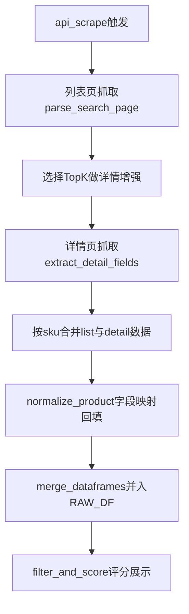

# Ozon 字段补齐中期优化计划

## 目标与范围
- 目标：提升 `scraped` 数据在关键字段（如 `月销量`、`跟卖数量`、类目、店铺信息）和成本字段（采购价、基础运费）的非空率。
- 范围：仅做中复杂度改造，不引入重型数据管道；保持现有 Flask + Playwright 架构。
- 约束：按你的要求，不引入“可用权重重分配”和“排序解释能力增强”。
- 约束：TopN 验收统计仅针对 `scraped` 数据集，`excel` 不参与该项验收。
- 约束：默认抓取数量 `detail_top_k=30`。
- 约束：删除 `excel` 参与的旧排序路径，统一采用纯 `scraped` 排序模式。

## 当前根因（已验证）
- 列表页解析仅产出少量字段，导致 `parser.normalize_product()` 中关键评分字段长期为 `None`。
- `filter_and_score()` 使用这些字段评分，`scraped` 行天然低分并在 TopN 中被压制。

关键代码位置：
- 采集主流程：[main.py](/Users/kyrie/Downloads/claude_code_use/ozon_demo/main.py)
- 抓取逻辑：[scraper.py](/Users/kyrie/Downloads/claude_code_use/ozon_demo/scraper.py)
- 解析与标准化：[parser.py](/Users/kyrie/Downloads/claude_code_use/ozon_demo/parser.py)
- 配置项：[config.yaml](/Users/kyrie/Downloads/claude_code_use/ozon_demo/config.yaml)

## 文件级实施清单（精确到文件）

### 1) [scraper.py](/Users/kyrie/Downloads/claude_code_use/ozon_demo/scraper.py)
- 新增配置读取：`detail_enrich_enabled`、`detail_top_k`、`detail_timeout`、`detail_concurrency`。
- 新增函数：
  - `collect_list_products(...)`：保留当前列表页抓取逻辑（可复用 `_extract_products`）。
  - `extract_detail_fields(page_html)`：提取 `一级类目`、`三级类目`、`跟卖数量`、可见销量提示。
  - `enrich_products_with_detail(products, config, context)`：对 TopK 做详情页补采并按 `sku_id` 回填。
- 输出结构从“扁平卡片”扩展为“字段可回填对象”（至少保证 `sku_id` 稳定主键）。
- 失败策略：详情抓取失败不终止主流程，记录 `detail_enrich_failed_count`。

### 2) [parser.py](/Users/kyrie/Downloads/claude_code_use/ozon_demo/parser.py)
- 调整 `normalize_product(raw)`：
  - 由“固定置空”改为“detail 优先、list 次之、最后置空”。
  - 保留现有字段兼容，不删除已有列。
- 新增工具函数：
  - `first_non_null(*vals)`：字段优先级回填。
  - `build_data_quality_flags(raw)`：生成轻量质量标记（如 `has_category`、`has_competition`）。
- 新增缺失判定函数：
  - `is_missing_value(v)`：仅将 `None/NaN/空字符串` 判为缺失，合法 `0` 不算缺失。
- 对 `月销量` 仅在明确可解析时填值，避免写入噪声值。

### 3) [estimator.py](/Users/kyrie/Downloads/claude_code_use/ozon_demo/estimator.py)（新增）
- 新增估算入口：`apply_estimates(df, cfg)`，输出以下新列：
  - `毛利率_est`
  - `展示至下单转化率_est`
  - `estimate_confidence`
  - `estimate_version`
- 新增子函数：
  - `estimate_margin(row, cfg)`：按规则公式估算毛利率。
  - `estimate_conversion(row, cfg)`：仅基于“可稳定爬取的真实字段”估算转化率。
  - `estimate_confidence(row, cfg)`：按输入字段完整度计算置信度。
- 约束：估算值写入 `_est` 列，不覆盖真实列。
- 约束：不返回“该分数使用了估算字段”的标志位。

### 4) [main.py](/Users/kyrie/Downloads/claude_code_use/ozon_demo/main.py)
- 在抓取合并后调用估算：`RAW_DF = apply_estimates(RAW_DF, cfg)`（受开关控制）。
- 在 `filter_and_score()` 引入补位评分（不改权重分配逻辑）：
  - `毛利率` 缺失时使用 `毛利率_est`
  - `展示至下单转化率` 缺失时使用 `展示至下单转化率_est`
- 纯 `scraped` 排序落地：在 `filter_and_score()` 中先过滤 `data_source == "scraped"`，再进行评分和排序。
- 若字段仍缺失，保持当前固定按 0 的行为；并确保合法 `0` 不被当作缺失触发补位。
- 日志增强：
  - 关键字段非空率（真实值 vs 估算值）
  - 1688 映射命中率、抓取成功率
- 接口兼容：保持 `/api/data` 返回结构兼容，新增列仅作为附加字段。

### 5) [config.yaml](/Users/kyrie/Downloads/claude_code_use/ozon_demo/config.yaml)
- 新增抓取增强配置：
  - `scraper.detail_enrich_enabled: true`
  - `scraper.detail_top_k: 30`
  - `scraper.detail_timeout: 30`
  - `scraper.detail_concurrency: 3`
- 新增 1688 配置：
  - `supplier1688.enabled: true`
  - `supplier1688.base_url: https://page.1688.com/`
  - `supplier1688.timeout: 30`
  - `supplier1688.fetch_fields: [purchase_price, freight_est]`
  - `supplier1688.mapping_file: supplier_mapping.csv`
  - `supplier1688.mapping_priority: keyword_first`
  - `supplier1688.slider_strategy: manual_intervention`
  - `supplier1688.default_values`（用于基础运费/佣金等默认值来源）
  - `supplier1688.default_priority: category_first`（类目默认 > 全局默认）
  - `supplier1688.match_rule: category_based`（按商品类别判定命中目标商品）
- 新增估算配置（`estimator` 节点）：
  - `enabled`, `version`
  - `commission_rate_default`, `ad_rate_default`, `return_loss_rate`
  - `category_purchase_ratio`（类目采购系数字典）
  - `conversion_weights`（评分/评论/价格竞争力/竞争强度权重）
  - `confidence_rules`（字段完整度到置信度映射）

### 6) [supplier_1688.py](/Users/kyrie/Downloads/claude_code_use/ozon_demo/supplier_1688.py)（新增）
- 新增 1688 采集适配层：
  - `load_mapping(mapping_file)`：读取人工映射（ozon_sku -> keyword/url）
  - `resolve_supplier_target(item, cfg)`：按 `keyword_first` 决定采集入口。
  - `open_page_1688(page, target)`：从 [1688 页面导航](https://page.1688.com/) 进入检索链路并落到目标商品页/结果页。
  - `is_category_match(ozon_category, supplier_item, cfg)`：基于“三级类目关键词”判定是否命中目标商品（写死规则）。
  - `fetch_supplier_fields(mapped_item, cfg)`：抓取采购价与基础运费估算
  - `merge_supplier_fields(df, supplier_df)`：按 `SkuId` 回填 `阿里巴巴采购价(预)`、`自定义1688运费金额`
- 滑块策略：检测到滑块/验证码即暂停并标记 `manual_required`，由人工介入后从当前 SKU 继续执行。
- 首版仅支持人工映射命中项，不做自动语义匹配。

### 7) [supplier_mapping.csv](/Users/kyrie/Downloads/claude_code_use/ozon_demo/supplier_mapping.csv)（新增）
- 字段定义：
  - `ozon_sku`（必填）
  - `supplier_keyword`（必填，优先）
  - `supplier_url`（可选，keyword 失败时兜底）
  - `note`（可选）
- 流程约束：`supplier_keyword` 为空则直接记录 `mapping_miss`，不进入抓取。
- 流程约束：1688 命中率分母定义为“有 mapping 的 SKU 数”。

### 8) [stable_fields.yml](/Users/kyrie/Downloads/claude_code_use/ozon_demo/stable_fields.yml)（新增）
- 用于维护“可稳定爬取真实字段”名单。
- 更新规则：字段需在连续 2 次爬取测试中成功，才可写入该名单。
- 估算模型仅使用该名单中的真实字段作为输入。

### 9) [templates/index.html](/Users/kyrie/Downloads/claude_code_use/ozon_demo/templates/index.html)
- 表格层新增可选展示列（不改主布局）：
  - `阿里巴巴采购价(预)`、`自定义1688运费金额`
  - `毛利率_est`、`展示至下单转化率_est`、`estimate_confidence`
- 对估算字段加“估算”标记，避免与真实字段混淆。
- 可选：在来源 badge 附加 `scraped(est)` 提示。

### 10) 测试文件
- [tests/test_parser.py](/Users/kyrie/Downloads/claude_code_use/ozon_demo/tests/test_parser.py)
  - 新增详情回填优先级测试
  - 新增质量标记生成测试
- [tests/test_1688.py](/Users/kyrie/Downloads/claude_code_use/ozon_demo/tests/test_1688.py)（新增）
  - 新增 mapping 读取测试
  - 新增 supplier 字段抓取与合并测试（可用 fixture/mock HTML）
- [tests/test_upgrade.py](/Users/kyrie/Downloads/claude_code_use/ozon_demo/tests/test_upgrade.py)
  - 新增估算列生成与评分补位测试（不含权重重分配）
- [tests/test_e2e.py](/Users/kyrie/Downloads/claude_code_use/ozon_demo/tests/test_e2e.py)
  - 新增页面可见 `1688成本字段` 与估算列展示 smoke case

## 实施策略（4阶段）

### 阶段1：详情页增量抓取（先补可抓到的核心字段）
- 在 `scraper.py` 增加“列表页后对 TopK SKU 进行详情页抓取”的流程（K 可配置，默认 20~30）。
- 新增详情页提取函数（例如 `extract_detail_fields(page_html)`），优先补字段：
  - `一级类目` / `三级类目`
  - `跟卖数量`（或可替代表征）
  - 可见的销量/购买数提示（若页面可见）
- 合并策略：按 `sku_id` 将 `list_data + detail_data` 合并后再进入 `normalize_product()`。

### 阶段2：解析器字段映射与回填规则
- 在 `parser.py` 新增字段回填优先级（detail 优先于 list，缺失保留 `None`）。
- 将 `normalize_product()` 从“固定置空”改为“按采集结果填充 + 无值时置空”。
- 增加轻量级质量标记：`data_quality_flags`（可选列）或日志统计（每批次字段填充率）。

### 阶段3：接入 1688 数据源补真实成本字段
- 增加人工映射文件 `supplier_mapping.csv`，以 `ozon_sku -> supplier_keyword` 为主键映射（keyword 优先）。
- 新增 `supplier_1688.py`，抓取：
  - `阿里巴巴采购价(预)`（真实抓取）
  - `自定义1688运费金额`（规则估算/页面可见值）
- 在抓取合并后，将 1688 字段回填到 `RAW_DF`。
- 参考站点入口：[1688 页面导航](https://page.1688.com/)
- 落地路径：
  - 从导航页进入 1688 搜索链路
  - 用 `supplier_keyword` 执行检索，命中目标商品
  - 命中规则：按“三级类目关键词”匹配判定（`category_based`）
  - 抓取采购价与可用运费线索
  - 若触发滑块，进入人工介入后从当前 SKU 继续

### 阶段4：引入“估算模型”替代仍缺失字段
- 新增 `estimator.py`，先采用规则估算模型：
  - `毛利率_est = (售价 - 采购估算 - 物流估算 - 佣金估算 - 广告估算 - 损耗估算) / 售价`
  - `展示至下单转化率_est` 仅基于可稳定爬取的真实字段加权估算。
- 在评分中启用“真实值优先，估算值补位”策略，不改现有权重分配。
- 输出 `estimate_confidence` 仅用于内部质量监控，不做排序解释。

### 阶段5：配置与验证闭环
- 在 `config.yaml` 增加抓取参数：
  - `detail_enrich_enabled`（bool）
  - `detail_top_k`（int）
  - `detail_timeout`（秒）
- 在 `config.yaml` 增加 `estimator` 参数（佣金、采购系数、转化权重、置信度规则）。
- 在 `main.py` 的抓取完成日志中增加字段补齐与估算覆盖统计。
- 补测试：
  - `tests/test_parser.py`：新增详情字段解析与映射单测
  - `tests/test_1688.py`：新增映射与字段回填单测
  - `tests/test_upgrade.py`：新增估算补位后的评分断言（不含权重重分配）
  - `tests/test_upgrade.py`：新增“合法 0 不被判缺失、且不触发 _est 覆盖”断言
  - 新增名单维护测试：仅当字段连续 2 次成功时写入 `stable_fields.yml`

## 数据流（优化后）

## 验收标准
### 硬验收口径
- 1688 映射命中样本中，`阿里巴巴采购价(预)` 非空率 >= 60%。
- 1688 映射命中样本中，`自定义1688运费金额` 非空率 >= 50%（允许默认值填充）。
- `scraped` 数据中，至少 2 个评分关键字段（真实或 `_est`）非空率 >= 40%。
- 对 `scraped` 子集独立排序时，TopN（N=20）中 `scraped` 占比为 100%（`excel` 不参与该验收计算）。
- 当 `scraped` 总数不足 N 时，TopN 按 `scraped` 实际数量计。
- 1688 命中率统计分母固定为“有 mapping 的 SKU 数”。
- 对含 `0` 的样本，补位前后该字段仍为 `0`，且不触发 `_est` 覆盖。
- 不破坏现有 `/api/scrape`、`/api/data`、`/api/dashboard-data`、`/api/ai-analyze` 接口行为。

## 风险与回退
- 风险：详情页抓取增大时延、反爬触发概率上升。
- 缓解：限制 `detail_top_k=30`、失败回退到列表数据、滑块人工介入。
- 回退：关闭 `detail_enrich_enabled` 即恢复当前行为。